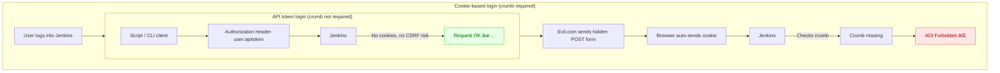

# Jenkins CSRF Crumb Protection – Summary

## What is a CSRF crumb?
- A **crumb** is a random token Jenkins issues to protect against **Cross-Site Request Forgery (CSRF)**.
- It ensures that only legitimate requests (from Jenkins UI or API clients) are accepted.

---

## Why crumbs are needed
- When using **cookie-based login (JSESSIONID)**:
  - Browsers automatically attach cookies to any request.
  - An attacker site (e.g., `evil.com`) could trick the browser into sending a POST to Jenkins.
  - Without a crumb, Jenkins would treat it as a valid request.
  - With a crumb check, Jenkins blocks the forged request.

- When using **API tokens (user:apitoken)**:
  - No cookies are auto-sent by the browser.
  - Attacker sites cannot steal or send tokens.
  - Since CSRF is not possible, Jenkins skips the crumb check.

---

## Key Takeaways
- **Cookie + Session Auth → Crumb required** ✅
- **API Token Auth → Crumb not required** ✅
- Crumbs protect against *CSRF*, not against authentication bypass.

---

## ASCII Diagram

```
=================== Cookie-based login (crumb required) ===================

   [User logs into Jenkins]
             |
   Browser stores JSESSIONID cookie
             |
   Evil.com sends hidden POST
             |
   Browser auto-sends cookie ---> [Jenkins]
                                   |
                            Crumb missing!
                                   |
                            [403 Forbidden ❌]

-------------------------------------------------------------------------

=================== API token login (crumb not required) =================

   [Script/CLI client]
             |
   Sends request with Authorization: user:apitoken
             |
            [Jenkins]
             |
   No cookies → no CSRF risk
             |
        [Request OK ✅]
```

---

## Mermaid Diagram


